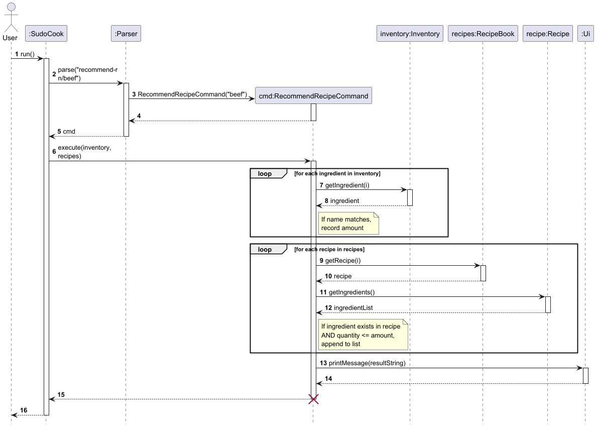

# Developer Guide

## Acknowledgements

{list here sources of all reused/adapted ideas, code, documentation, and third-party libraries -- include links to the original source as well}

## Design & implementation

### `recommend-r` — Ingredient-based Recipe Recommendation

#### Overview

The `recommend-r` command recommends recipes that the user can make given a specific ingredient                                                                       
currently in their inventory. It checks that the ingredient exists in the inventory and that the
recipe's required quantity does not exceed what is available.

**Command format:** `recommend-r n/INGREDIENT_NAME`

  ---

#### Implementation

The feature involves four classes:

| Class | Role |
|---|---|
| `Parser` | Parses raw input, validates format, and constructs a `RecommendRecipeCommand` |
| `RecommendRecipeCommand` | Executes the recommendation logic |
| `Inventory` | Provides access to current ingredient stocks |
| `RecipeBook` | Provides access to all known recipes |

**Step-by-step execution:**

1. The user enters `recommend-r n/<ingredient>`.
2. `Parser.parse()` verifies the `n/` prefix and extracts the ingredient name. If the format is
   invalid or the name is empty, an error is printed and a no-op `Command` is returned.
3. A `RecommendRecipeCommand` is constructed with the ingredient name.
4. `SudoCook` detects the command type and calls `cmd.execute(inventory, recipes)`.
5. Inside `execute()`:
    - The inventory is searched linearly for a case-insensitive match. The available quantity is recorded.
    - If the ingredient is not found, `Ui.printError()` is called and execution stops.
    - Otherwise, each recipe in `RecipeBook` is inspected. A recipe qualifies if it contains the
      ingredient **and** requires a quantity ≤ the available amount.
    - If no recipe qualifies, a "No recipes meet the requirement" message is printed; otherwise the
      list of matching recipe names is printed.

Key snippet from `RecommendRecipeCommand`:

```text
  for (int i = 0; i < recipes.size(); i++) {
      Recipe recipe = recipes.getRecipe(i);
      for (Ingredient ing : recipe.getIngredients()) {
          if (ing.getName().equalsIgnoreCase(ingredientName)
                  && ing.getQuantity() <= amount) {
              count += 1;
              sb.append(count).append(". ").append(recipe.getName()).append("\n");
              break;
          }
      }
  }
```

  ---

#### Sequence Diagram



*Figure 1: Sequence Diagram for the `recommend-r` command*

  ---

#### Design Considerations

**Aspect: Case sensitivity of ingredient matching**

| Option | Pros | Cons |
|---|---|---|
| Case-insensitive (current) | User-friendly; `Sugar`, `sugar`, `SUGAR` all match | Slight overhead from `equalsIgnoreCase()` |
| Case-sensitive | Simpler comparison | Error-prone for users; `sugar` would not match `Sugar` |

*Decision:* Case-insensitive matching was chosen to reduce user friction.

  ---

**Aspect: Quantity comparison**

| Option | Pros | Cons |
|---|---|---|
| `required ≤ available` (current) | Includes recipes the user has just enough for | Cannot account for partial use in the same session |
| `required < available` | Leaves a buffer | Unnecessarily excludes exact-match recipes |

*Decision:* `≤` comparison is used so that a recipe requiring exactly the available quantity is still recommended.

  ---

**Aspect: Searching strategy**

| Option | Pros | Cons |
|---|---|---|
| Linear scan (current) | Simple; no extra data structure needed | O(n·m) where n = recipes, m = ingredients per recipe |
| Pre-built index (ingredient → recipes) | O(1) lookup per ingredient | Added complexity; index must stay in sync |

*Decision:* Linear scan is sufficient for the expected data sizes. An index can be introduced if performance becomes a concern.


## Product scope
### Target user profile

{Describe the target user profile}

### Value proposition

{Describe the value proposition: what problem does it solve?}

## User Stories

|Version| As a ... | I want to ... | So that I can ...|
|--------|----------|---------------|------------------|
|v1.0|new user|see usage instructions|refer to them when I forget how to use the application|
|v2.0|user|find a to-do item by name|locate a to-do without having to go through the entire list|

## Non-Functional Requirements

{Give non-functional requirements}

## Glossary

* *glossary item* - Definition

## Instructions for manual testing

{Give instructions on how to do a manual product testing e.g., how to load sample data to be used for testing}
