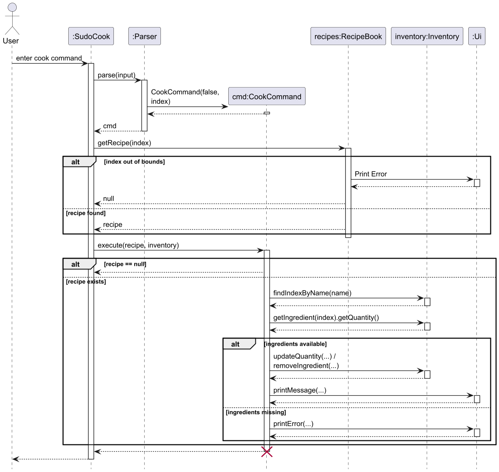

# Developer Guide

## Acknowledgements

{list here sources of all reused/adapted ideas, code, documentation, and third-party libraries -- include links to the original source as well}

## Design & implementation

### `recommend-r` — Ingredient-based Recipe Recommendation

#### Overview

The `recommend-r` command recommends recipes that the user can make given a specific ingredient                                                                       
currently in their inventory. It checks that the ingredient exists in the inventory and that the
recipe's required quantity does not exceed what is available.

**Command format:** `recommend-r n/INGREDIENT_NAME`

  ---

#### Implementation

The feature involves four classes:

| Class | Role |
|---|---|
| `Parser` | Parses raw input, validates format, and constructs a `RecommendRecipeCommand` |
| `RecommendRecipeCommand` | Executes the recommendation logic |
| `Inventory` | Provides access to current ingredient stocks |
| `RecipeBook` | Provides access to all known recipes |

**Step-by-step execution:**

1. The user enters `recommend-r n/<ingredient>`.
2. `Parser.parse()` verifies the `n/` prefix and extracts the ingredient name. If the format is
   invalid or the name is empty, an error is printed and a no-op `Command` is returned.
3. A `RecommendRecipeCommand` is constructed with the ingredient name.
4. `SudoCook` detects the command type and calls `cmd.execute(inventory, recipes)`.
5. Inside `execute()`:
    - The inventory is searched linearly for a case-insensitive match. The available quantity is recorded.
    - If the ingredient is not found, `Ui.printError()` is called and execution stops.
    - Otherwise, each recipe in `RecipeBook` is inspected. A recipe qualifies if it contains the
      ingredient **and** requires a quantity ≤ the available amount.
    - If no recipe qualifies, a "No recipes meet the requirement" message is printed; otherwise the
      list of matching recipe names is printed.

Key snippet from `RecommendRecipeCommand`:

```text
  for (int i = 0; i < recipes.size(); i++) {
      Recipe recipe = recipes.getRecipe(i);
      for (Ingredient ing : recipe.getIngredients()) {
          if (ing.getName().equalsIgnoreCase(ingredientName)
                  && ing.getQuantity() <= amount) {
              count += 1;
              sb.append(count).append(". ").append(recipe.getName()).append("\n");
              break;
          }
      }
  }
```

  ---

#### Sequence Diagram


*Figure 1: Sequence Diagram for the `recommend-r` command*

  ---

#### Design Considerations

**Aspect: Case sensitivity of ingredient matching**

| Option | Pros | Cons |
|---|---|---|
| Case-insensitive (current) | User-friendly; `Sugar`, `sugar`, `SUGAR` all match | Slight overhead from `equalsIgnoreCase()` |
| Case-sensitive | Simpler comparison | Error-prone for users; `sugar` would not match `Sugar` |

*Decision:* Case-insensitive matching was chosen to reduce user friction.

  ---

**Aspect: Quantity comparison**

| Option | Pros | Cons |
|---|---|---|
| `required ≤ available` (current) | Includes recipes the user has just enough for | Cannot account for partial use in the same session |
| `required < available` | Leaves a buffer | Unnecessarily excludes exact-match recipes |

*Decision:* `≤` comparison is used so that a recipe requiring exactly the available quantity is still recommended.

  ---

**Aspect: Searching strategy**

| Option | Pros | Cons |
|---|---|---|
| Linear scan (current) | Simple; no extra data structure needed | O(n·m) where n = recipes, m = ingredients per recipe |
| Pre-built index (ingredient → recipes) | O(1) lookup per ingredient | Added complexity; index must stay in sync |

*Decision:* Linear scan is sufficient for the expected data sizes. An index can be introduced if performance becomes a concern.

### `list-r` and `view-r` — Recipe Listing and Viewing

#### Overview

Two commands are provided for browsing recipes:

- `list-r` prints a compact numbered list of recipe names only, giving the user a quick overview.
- `view-r` prints full recipe details (ingredients and steps). It can be used with or without an index.

**Command formats:**
- `list-r` — lists all recipe names
- `view-r` — shows full details for all recipes
- `view-r INDEX` — shows full details for the recipe at the given 1-based index

---

#### Implementation

Both commands delegate to `RecipeBook` via `ListRecipeCommand` and `ViewRecipeCommand` respectively.

| Class | Role |
|---|---|
| `Parser` | Detects `list-r` or `view-r` prefix and constructs the appropriate command |
| `ListRecipeCommand` | Calls `RecipeBook.listRecipe()` |
| `ViewRecipeCommand` | Calls `RecipeBook.viewRecipe()` or `RecipeBook.viewRecipe(index)` |
| `RecipeBook` | Builds and prints the output string |

**`list-r` execution:**

1. `RecipeBook.listRecipe()` iterates over all recipes and appends only the name of each to a `StringBuilder`.
2. The result is printed via `Ui.printGradientMessage()`.

**`view-r` execution:**

1. If no index is given, `RecipeBook.viewRecipe()` iterates over all recipes and appends the full `toString()` of each (with a numbered prefix) to a `StringBuilder`.
2. If an index is given, `RecipeBook.viewRecipe(int index)` validates the index and prints the single recipe's `toString()` directly.
3. Invalid indices print an error via `Ui.printError()`.

#### Design Considerations

**Aspect: Separating list and view into two commands**

| Option | Pros | Cons |
|---|---|---|
| Separate `list-r` (names) and `view-r` (details) (current) | Quick overview with `list-r`; full details on demand with `view-r` | Two commands to remember |
| Single command always showing full details | Fewer commands | Clutters output when the user only wants a name reminder |

*Decision:* Splitting the commands keeps everyday browsing fast while still allowing full detail inspection when needed.

---

### `cook` - Cook a Recipe

#### Overview

The `cook` command prepares a recipe by consuming the required ingredients from the user's
inventory. It first checks that the requested recipe exists and that every required ingredient is
available in sufficient quantity before any inventory updates are made.

**Command format:** `cook INDEX`

  ---

#### Implementation

The feature involves four main classes:

| Class | Role |
|---|---|
| `Parser` | Parses raw input, validates the recipe index, and constructs a `CookCommand` |
| `CookCommand` | Validates ingredient availability and performs the cooking logic |
| `RecipeBook` | Provides access to the recipe selected by the user |
| `Inventory` | Stores ingredient quantities and is updated after a successful cook |

**Step-by-step execution:**

1. The user enters `cook <index>`.
2. `Parser.parse()` detects the `cook` prefix, parses the recipe index, converts it from 1-based to
   0-based form, and constructs a `CookCommand`.
3. If the index is not a valid number, an error is printed and a no-op `Command` is returned.
4. `SudoCook` detects the command type, retrieves the target recipe using
   `recipes.getRecipe(cmd.getIndex())`, and calls `cmd.execute(recipe, inventory)`.
5. Inside `execute()`:
    - If the recipe is `null`, execution stops immediately. This happens when the requested index is
      out of bounds.
    - The recipe's ingredient list is checked first to ensure every required ingredient exists in
      the inventory and has enough quantity.
    - If any ingredient is missing or insufficient, `Ui.printError()` is called and the inventory
      remains unchanged.
    - If all checks pass, the required quantities are removed from the inventory and a success
      message is printed.

Key snippet from `CookCommand`:

```text
  for (Ingredient i : recipe.getIngredients()) {
      int ingredientIndex = inventory.findIndexByName(i.getName());
      if (ingredientIndex < 0
              || inventory.getIngredient(ingredientIndex).getQuantity() < i.getQuantity()) {
          throw new RuntimeException("Not enough ingredients");
      }
  }

  for (Ingredient i : recipe.getIngredients()) {
      Command c = new DeleteIngredientCommand(i.getName(), i.getQuantity());
      c.execute(inventory);
  }
```

  ---

#### Sequence Diagram



*Figure 2: Sequence Diagram for the `cook` command*

  ---

#### Design Considerations

**Aspect: Indexing of recipes**

| Option | Pros | Cons |
|---|---|---|
| 1-based user input, converted internally (current) | Matches how recipes are shown in lists; more natural for users | Requires conversion before lookup |
| 0-based user input | Aligns directly with internal storage | Less intuitive for end users |

*Decision:* 1-based indexing was chosen for the user-facing command because recipe lists are also
displayed starting from 1.

  ---

**Aspect: Inventory update strategy**

| Option | Pros | Cons |
|---|---|---|
| Validate all ingredients before removal (current) | Prevents partial updates; preserves consistency on failure | Requires two passes over the ingredient list |
| Remove ingredients as they are checked | Slightly simpler flow | Can leave inventory partially updated if a later ingredient is missing |

*Decision:* Validation is performed before removal so `cook` behaves as an all-or-nothing operation.

  ---

**Aspect: Reusing deletion logic**

| Option | Pros | Cons |
|---|---|---|
| Reuse `DeleteIngredientCommand` for quantity removal (current) | Avoids duplicating inventory update logic | Adds an extra command object per ingredient |
| Update `Inventory` directly inside `CookCommand` | Fewer intermediate objects | Duplicates removal behavior and message handling |

*Decision:* Reusing `DeleteIngredientCommand` keeps ingredient-removal behavior centralized even
though it adds a small amount of indirection.

### `sort-i` - Sort Inventory by Expiry Date

#### Overview

The `sort-i` command sorts the inventory so that ingredients with earlier expiry dates appear
first. Ingredients without an expiry date are placed at the end of the list.

**Command format:** `sort-i`

  ---

#### Implementation

The feature involves four main classes:

| Class | Role |
|---|---|
| `Parser` | Detects the `sort-i` prefix and constructs a `SortInventoryCommand` |
| `SortInventoryCommand` | Delegates sorting to `Inventory` and prints a confirmation message |
| `Inventory` | Stores ingredients and performs the in-place sort |
| `Ui` | Displays the success message |

**Step-by-step execution:**

1. The user enters `sort-i`.
2. `Parser.parse()` detects the prefix and constructs a `SortInventoryCommand`.
3. `SudoCook` detects the command type and calls `cmd.execute(inventory)`.
4. Inside `execute()`:
    - `Inventory.sortIngredients()` sorts the internal ingredient list by expiry date.
    - `Ui.printMessage("Sorted!")` is called to confirm completion.

Key snippet from `SortInventoryCommand`:

```text
  public void execute (Inventory ingredients){
      ingredients.sortIngredients();
      Ui.printMessage("Sorted!");
  }
```

  ---

#### Sequence Diagram


*Figure 3: Sequence Diagram for the `sort-i` command*

  ---

#### Design Considerations

**Aspect: Sorting criterion**

| Option | Pros | Cons |
|---|---|---|
| Sort by expiry date with `null` values last (current) | Helps users prioritise ingredients that expire sooner | Less useful when many ingredients have no expiry date |
| Sort alphabetically by name | Easy to scan for a specific ingredient | Does not help with expiry-based planning |

*Decision:* Sorting by expiry date is more useful for kitchen inventory management because it
surfaces ingredients that should be used sooner.

  ---

**Aspect: Location of sorting logic**

| Option | Pros | Cons |
|---|---|---|
| Keep sorting in `Inventory` (current) | Keeps data manipulation close to the stored list; command stays simple | Sort order is defined in the inventory layer |
| Implement sorting in `SortInventoryCommand` | Makes the command self-contained | Mixes orchestration with collection logic |

*Decision:* The sorting logic is kept in `Inventory` so command classes remain focused on
triggering behaviour rather than manipulating internal data structures directly.


## Product scope
### Target user profile

{Describe the target user profile}

### Value proposition

{Describe the value proposition: what problem does it solve?}

## User Stories

|Version| As a ... | I want to ... | So that I can ...|
|--------|----------|---------------|------------------|
|v1.0|new user|see usage instructions|refer to them when I forget how to use the application|
|v2.0|user|find a to-do item by name|locate a to-do without having to go through the entire list|

## Non-Functional Requirements

{Give non-functional requirements}

## Glossary

* *glossary item* - Definition

## Instructions for manual testing

{Give instructions on how to do a manual product testing e.g., how to load sample data to be used for testing}
