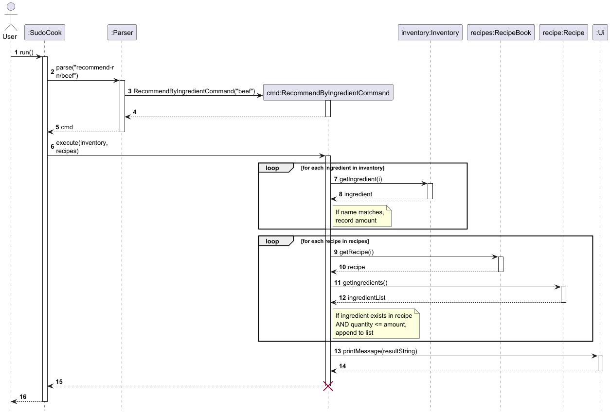
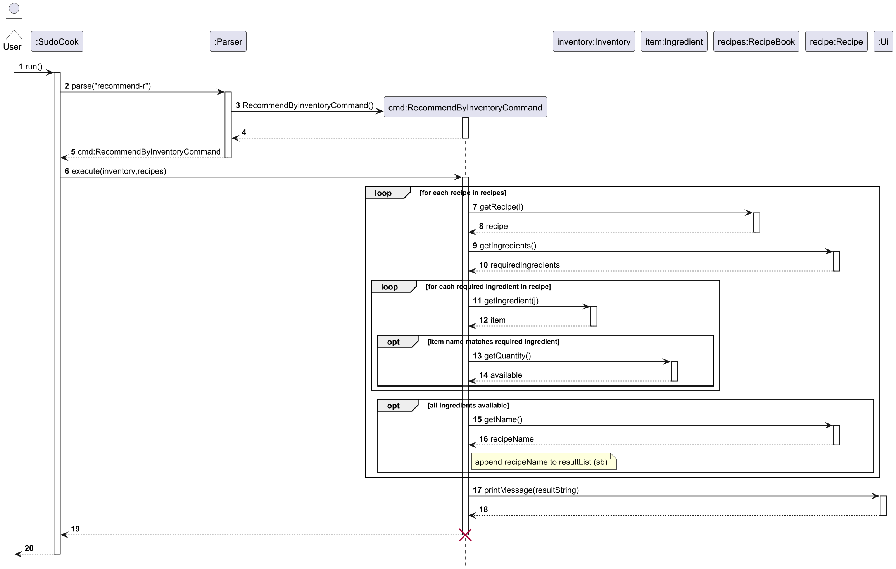

# Project Portfolio Page - Wang Pengjin

## Project: SudoCook
**SudoCook** is a Java-based Command-Line Interface (CLI) application designed to help users manage recipes and kitchen
inventory efficiently. It enables students and home cooks to track their ingredients and discover what they can cook
through an intuitive text interface.

---

## Summary of Contributions

### 1. Code Contributed
[Link to my code on the tP Code Dashboard](https://nus-cs2113-ay2526-s2.github.io/tp-dashboard/?search=e1484104&breakdown=true&sort=groupTitle%20dsc&sortWithin=title&since=2026-02-20T00%3A00%3A00&timeframe=commit&mergegroup=&groupSelect=groupByRepos&checkedFileTypes=docs~functional-code~test-code~other&filteredFileName=)

### 2. Enhancements Implemented

* **Implemented `delete-r` command** (`DeleteRecipeCommand.java`)
    * Developed the logic to remove a specific recipe from the `RecipeBook` by 1-based index.
    * Handles invalid input gracefully: non-numeric indices are caught during parsing and reported
      immediately; out-of-range indices are caught via `IndexOutOfBoundsException` inside
      `RecipeBook.removeRecipe()`, keeping the validation logic centralised in the data class.

* **Implemented `recommend-r` command suite** (`RecommendByIngredientCommand.java`, `RecommendByInventoryCommand.java`, `RecommendByMissingCommand.java`)
    * Built three complementary recommendation modes under a single command prefix:
        * **Ingredient-based** (`recommend-r n/INGREDIENT_NAME`): cross-references a named ingredient
          in the `Inventory` with the ingredient lists of every recipe in `RecipeBook`, filtering
          for recipes whose required quantity does not exceed the available stock.
        * **Inventory-based** (`recommend-r`): iterates over every recipe and checks **all** of its
          required ingredients against the full inventory in one pass using the `canMake()` helper,
          returning only recipes that can be fully prepared with current stock.
        * **Missing-based** (`recommend-r missing/N`): finds recipes missing at most N ingredients
          and reports the exact shortfall (required − available) for each missing item, giving the
          user a precise shopping list for recipes they are almost able to cook.
    * All modes use case-insensitive matching (`equalsIgnoreCase`) and `≤` quantity comparison so
      that recipes requiring exactly the available amount are still recommended.
    * Added comprehensive unit tests for all three modes covering: successful match, empty inventory,
      insufficient quantity, missing ingredient, multiple recipes, exact quantity boundary, shortfall
      quantity/unit display, fully-makeable recipe exclusion, and parser-level format validation
      (28 test cases total across the three test files).

* **Authored PlantUML sequence diagrams** (`RecommendSD.puml`, `RecommendByInventorySD.puml`)
    * Created the sequence diagram for the ingredient-based flow showing the two-phase linear scan
      (inventory lookup then recipe matching).
    * Created the sequence diagram for the inventory-based flow showing the nested loop structure
      of `canMake()` with early-exit behaviour on the first unmet ingredient.

### 3. Contributions to the User Guide (UG)
* Authored the `recommend-r` section covering all three modes with format specifications, parameter
  notes (case-insensitivity, quantity rule), usage examples, and expected output variants for each
  mode including the missing-based mode (shortfall display, no-match, invalid N).
* Authored the `delete-r` section with format specification, preconditions (use `list-r` first,
  irreversibility warning), usage examples, and all three expected output variants (success,
  out-of-range, non-numeric input).

### 4. Contributions to the Developer Guide (DG)
* Authored the `recommend-r` implementation section covering all three modes:
    * Class responsibility table for all six involved classes.
    * Step-by-step execution walkthrough for each mode.
    * Annotated code snippets for the core matching loop, `canMake()`, and `getMissingIngredients()`.
    * Four Design Consideration aspects with option tables and rationale (three-modes-vs-separate-commands, case sensitivity, quantity comparison, search strategy).
* Authored the `delete-r` implementation section:
    * Class responsibility table for the three involved classes.
    * Step-by-step execution walkthrough explaining the `DELETE_R_PREFIX` constant and 1-based to
      0-based index conversion.
    * Annotated code snippet for `RecipeBook.removeRecipe()`.
    * One Design Consideration aspect with option tables and rationale (index convention).

### 5. Contributions to Team-Based Tasks
* **Initial Architecture**: Established the foundational structure and initial states for the `Recipe` and `RecipeBook` classes.
* **Task Management**: Led the planning for each development cycle, including issue assignment and task decomposition.
* **Testing Infrastructure**: Refined the `text-ui-test` comparison mode to ignore logging information, ensuring that background logs do not cause test failures.
* **UI Standardization**: Unified the application's output format to ensure a professional and consistent visual experience across all commands.
* **DG Team-based Part**: Complete the Target user profile, Value proposition and User Stories in Project Scope section.

### 6. Review/Mentoring Contributions
* **Bug Fixing**: Assisted teammates in troubleshooting `text-ui-test` failures caused by terminal color codes, ensuring all tests passed.

---

## Contributions to the User Guide (Extracts)

### Recommending recipes: `recommend-r`

The `recommend-r` command has three modes:

- **Ingredient-based** — finds recipes that use a specific ingredient you already have enough of.
- **Inventory-based** — finds every recipe that can be fully made using your current inventory.
- **Missing-based** — finds recipes you are almost able to make, listing exactly what you still need to buy.

<br>

#### Ingredient-based recommendation

Shows all recipes that contain a specific ingredient, provided your inventory holds at least the required quantity.

Format: `recommend-r n/INGREDIENT_NAME`

* `INGREDIENT_NAME` is case-insensitive (`egg`, `Egg`, and `EGG` all work).
* The ingredient must exist in your inventory; otherwise an error is shown.
* Only recipes whose required quantity of the ingredient is **≤** the amount you have are listed.

Examples:

`recommend-r n/egg`

`recommend-r n/Sugar`

Expected output (ingredient found, matching recipes exist):
```
Recipes containing egg:
1. Omelette
2. Fried Rice
```

Expected output (ingredient not in inventory):
```
Oops! Ingredient "beef" does not exist in inventory.
```

Expected output (ingredient in inventory but no recipe uses enough of it):
```
No recipes meet the requirement
```

<br>

#### Inventory-based recommendation

Shows all recipes that can be fully made with your current inventory — every required ingredient must be present in sufficient quantity.

Format: `recommend-r`

* A recipe is only listed if **all** of its ingredients are available in the inventory with enough quantity.
* Ingredient name matching is case-insensitive.

Example:

`recommend-r`

Expected output (some recipes are makeable):
```
Recipes you can make with your inventory:
1. Omelette
2. Mixue
```

Expected output (no recipe can be fully made):
```
No recipes can be made with the current inventory.
```

<br>

#### Missing-based recommendation

Shows recipes you are **almost** able to make — those missing at most `N` ingredients. For each recipe shown, the exact shortfall for each missing ingredient is listed.

Format: `recommend-r missing/N`

* `N` must be a positive integer.
* Recipes you can already make in full are excluded.
* For each missing ingredient the output shows the name, shortfall amount, and unit.
* Ingredient name matching is case-insensitive.

Examples:

`recommend-r missing/1`

`recommend-r missing/2`

Expected output (some recipes qualify):
```
Recipes you're almost able to make:
1. Omelette (missing: Salt (1.0 g))
2. Pasta (missing: Flour (200.0 g), Salt (5.0 g))
```

Expected output (no recipe qualifies):
```
No recipes found missing at most 1 ingredient(s).
```

Expected output (invalid N):
```
Oops! Missing count must be a positive number.
```

---

### Deleting a recipe: `delete-r`

Removes a recipe from the recipe book by its index.

Format: `delete-r INDEX`

* `INDEX` must be a positive integer corresponding to the recipe's position in the recipe list.
* Use `list-r` first to confirm the index of the recipe you want to delete.
* The deletion cannot be undone.

Examples:

`delete-r 1`

`delete-r 3`

Expected output (successful deletion):
```
Recipe 1 deleted successfully.
```

Expected output (index out of range):
```
Invalid index: Index 5 is out of range. Valid range: 1 to 3
```

Expected output (non-numeric index):
```
Oops! Invalid index for delete-r. Use: delete-r INDEX
```

---

## Contributions to the Developer Guide (Extracts)

### `recommend-r` — Recipe Recommendation

#### Overview

The `recommend-r` command supports three modes of recipe recommendation:

- **Ingredient-based mode** (`recommend-r n/INGREDIENT_NAME`): recommends recipes that use a specific
  ingredient, provided the inventory holds enough of it.
- **Inventory-based mode** (`recommend-r`): recommends every recipe whose **full** ingredient list
  can be satisfied by the current inventory — i.e. every required ingredient is present and in
  sufficient quantity.
- **Missing-based mode** (`recommend-r missing/N`): recommends recipes missing at most N ingredients,
  reporting the exact shortfall per item so the user has a ready shopping list.

**Command formats:**

| Mode | Format | Example |
|---|---|---|
| Ingredient-based | `recommend-r n/INGREDIENT_NAME` | `recommend-r n/egg` |
| Inventory-based | `recommend-r` | `recommend-r` |
| Missing-based | `recommend-r missing/N` | `recommend-r missing/2` |

#### Sequence Diagrams



*Figure 1: Sequence Diagram for `recommend-r n/INGREDIENT_NAME` (ingredient-based mode)*

<br>



*Figure 2: Sequence Diagram for `recommend-r` (inventory-based mode)*

#### Design Considerations

**Aspect: Two modes under one command vs. separate commands**

| Option | Pros | Cons |
|---|---|---|
| Single `recommend-r` command with optional `n/` argument (current) | Consistent command prefix; easier to discover both modes via `help` | Slightly more complex parsing logic |
| Separate commands (e.g. `recommend-r` and `recommend-all`) | Fully independent; no shared parsing | More commands for the user to remember |

*Decision:* Keeping both modes under `recommend-r` provides a natural extension of the existing
command and keeps the help output concise.

---

### `delete-r` — Delete a Recipe

#### Overview

The `delete-r` command permanently removes a recipe from the recipe book by its 1-based index.

**Command format:** `delete-r INDEX`

#### Implementation

| Class | Role |
|---|---|
| `Parser` | Parses raw input, validates that the index is a number, and constructs a `DeleteRecipeCommand` |
| `DeleteRecipeCommand` | Calls `RecipeBook.removeRecipe()` with the given index |
| `RecipeBook` | Validates the index range and performs the removal |

Key snippet from `RecipeBook`:

```text
  public void removeRecipe(int index) {
      if (index < 1 || index > recipes.size()) {
          throw new IndexOutOfBoundsException(
                  "Index " + index + " is out of range. Valid range: 1 to " + recipes.size()
          );
      }
      recipes.remove(index - 1);
  }
```

#### Design Considerations

**Aspect: Index convention (1-based vs 0-based)**

| Option | Pros | Cons |
|---|---|---|
| 1-based user input (current) | Matches the numbered list shown by `list-r` and `view-r` | Requires `index - 1` conversion before `ArrayList.remove()` |
| 0-based user input | Aligns directly with internal storage | Counter-intuitive; users see 1-based numbering in list output |

*Decision:* 1-based indexing is used to stay consistent with `list-r` and `view-r` output, so the
index the user sees is the same index they use to delete.

## Product scope
### Target user profile

A single student living independently (e.g., in a campus dorm) who types fast and prefers keyboard-driven workflows over
mouse/touch input. This student enjoys cooking by himself/herself, but often gets frustrated because of being too lazy
to organize the stored ingredients and not knowing what to cook.


### Value proposition

SudoCook is a cross-platform, portable, command-line pantry and recipe helper that reduces food waste by letting the
user quickly log ingredients and expiry dates, and reduces meal indecision by suggesting recipes based on what’s
currently in the pantry and the user’s available cooking time. All data is stored locally in a human-editable plain-text
file (e.g., JSON or CSV) and managed through an object-oriented Java 17 codebase packaged as a single runnable JAR, with
no DBMS and no reliance on remote servers.


## User Stories

|Version| As a ...     | I want to ... | So that I can ...|
|--------|--------------|---------------|------------------|
|v1.0| Busy Student |Add an item and expiry date using a single short command|I can digitize my pantry quickly after grocery shopping|
|v1.0| Novice Cook  |View step-by-step instructions for a specific recipe|I can follow the process accurately and complete the dish|
|v1.0| User|Delete items quickly|My inventory list remains accurate after I throw things away/ use them|
|v1.0| User |View all ingredients|I know what ingredients have been added so far|
|v1.0| User |Add a recipe|I don't have to rely on my memory for instructions|
|v1.0| User |Delete a recipe|I can keep my recipe list clean and organized|
|v2.0| Budget-conscious Student|List all items sorted by their expiry dates|I can prioritize ingredients about to spoil and avoid wasting money|
|v2.0| Indecisive Student|Request recipe suggestions based on current stock|I don't have to spend mental energy deciding what to cook|
|v2.0| Power User|Mark a recipe as "cooked" to auto-deduct ingredients|My stock levels remain accurate with minimal manual adjustment|
|v2.0| Organized Student|Compare a specific dish's requirements against inventory|I can see if I have everything or need a precise shopping list|
|v2.0| Fast-typer|Use an "undo" command to revert the last change|I can quickly fix accidental deletions or typos|
|v2.0| Tech-savvy User|Store data in a human-editable JSON/CSV file|My data is permanent, portable, and easy to backup|
|v2.0| Health-conscious Student|Specify a dietary plan (e.g., Vegan) for automated meal plans|I can maintain nutritional goals without manual calculations|
